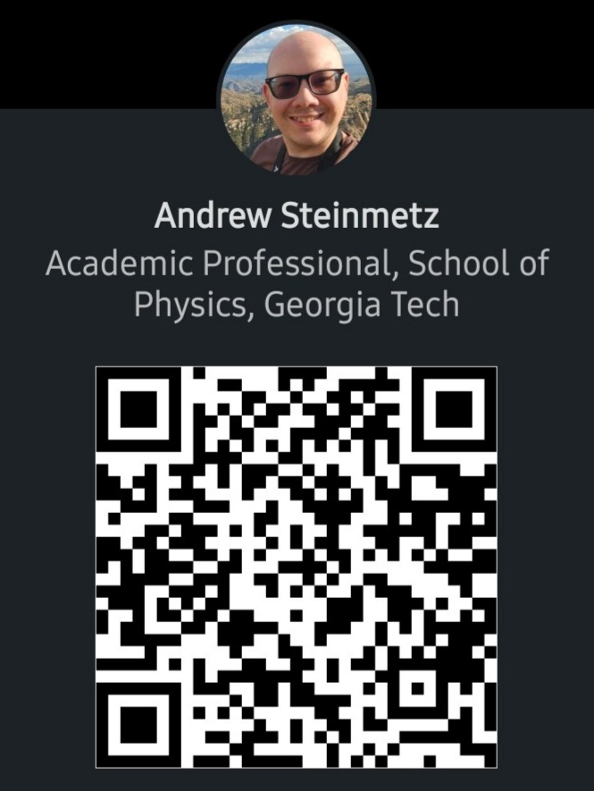
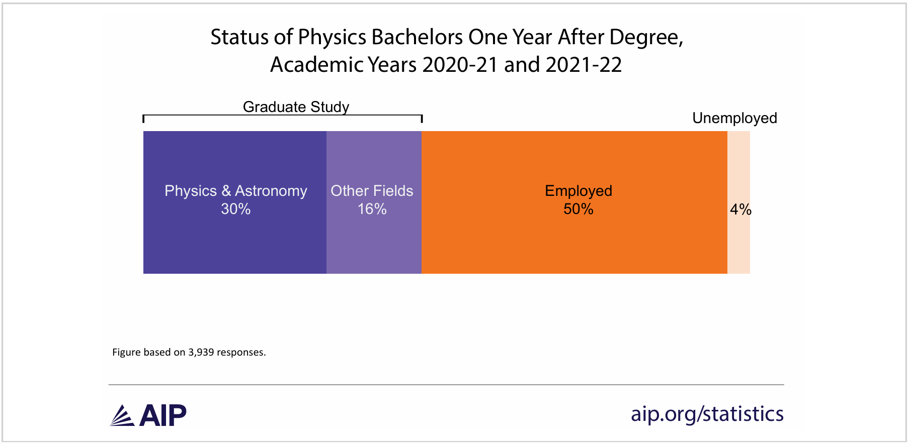

## Your Instructor & Team Leader

:::: {.columns}
::: {.column width="50%"}
**Dr. Andrew J. Steinmetz**

School of Physics · Georgia Institute of Technology

| | |
|---|---|
| **Email** | [ajsteinmetz@gatech.edu](mailto:ajsteinmetz@gatech.edu) |
| **Office hours** | [By appointment (link)](https://outlook.office.com/bookwithme/user/118287044b844adb8cb5cfaadd54546f@gatech.edu?anonymous&ismsaljsauthenabled&ep=plink) |
| **Office** | Howey W204 |

**Elouan Crews**

Your Team Leader

| | |
|---|---|
| **Email** | [ecrews8@gatech.edu](mailto:ecrews8@gatech.edu) |

:::
::: {.column width="50%"}
{fig-align="center" width="100%"}

::: {.cite-note}
[https://www.linkedin.com/in/ajsteinmetz/](https://www.linkedin.com/in/ajsteinmetz/)
:::

:::
::::


---

## Welcome to GT 1000

:::: {.columns}
::: {.column width="60%"}
This seminar is here to help you make a successful transition to college by getting you better acquainted with the academic and social environments at Georgia Tech and explore what it actually means to be a physicist.

This is a discussion-based course. Come ready to participate and to work in small groups.

### Course websites:

- [https://canvas.gatech.edu/](https://canvas.gatech.edu/)
- [https://ajsteinmetz.github.io/gt-gt-1000/](https://ajsteinmetz.github.io/gt-gt-1000/)
:::

::: {.column width="40%"}
{fig-align="center" width="100%"}

::: {.cite-note}
[xkcd #2756 "Qualifications"](https://xkcd.com/2756/) · [CC BY-NC 2.5](https://creativecommons.org/licenses/by-nc/2.5/)
:::

:::
::::

---

## Syllabus - Learning Outcomes

By the end of this course, you will be able to:

::: {.nonincremental}
1. **Develop self-awareness and self-knowledge**, particularly as it relates to your academic interests and professional goals.
2. **Describe your path to graduation** and identify opportunities for academic and professional enrichment with the assistance of a faculty member or advisor.
3. **Demonstrate the ability to lead** and productively participate in collaborative projects.
4. **Be aware of what it means to be a physicist** and explore opportunities for physicists at the undergraduate, graduate, and career levels.
:::

---

## Syllabus - How You Are Graded

| Course Component | Due | Weight |
|---|---|---|
| Participation, short assignments, and attendance | Weekly | 25% |
| Team Project | TBD | 25% |
| Academic Planning | Multiple deliverables | 25% |
| Career Readiness | Multiple deliverables | 25% |

::: {.callout-note}
All four components are weighted equally and there are no exams in this course. The first Career Readiness deliverable is your **résumé, due September 11**.
:::


---

## Course Policies - The Short Version

- **Attendance is mandatory.** Excessive lateness and absences (three or more per semester) can negatively impact your final grade. Excused absences go through the Dean of Students.
- **No textbook.** Materials are provided through Canvas/course website.
- **No exams.**
- **The use of generative AI is strongly discouraged.** Brainstorming with it is fine, but per the Honor Code no work produced via AI may be submitted as your own.
- **Late work is not accepted.** All assignments are open the entire semester, so plan ahead.
- **When in doubt, ask.** Email or office hours.

---

## Part I: What do I do with my degree?

You picked this major a few weeks ago. Here is where it goes.

{fig-align="center" width="80%"}

::: {.cite-note style="margin-top: -0.5em;"}
[@mulvey2025]
:::

---

## GaTech B.S. Physics: Starting Salaries

Reported initial median salaries range from $74,000 to $86,500 and are competitive or in excess of national trends reported by NACE.

```{python}
#| echo: false
#| fig-align: center
import matplotlib
import matplotlib.pyplot as plt
import numpy as np

matplotlib.rcParams.update({'font.family': 'sans-serif'})

years  = ['2020–21', '2021–22', '2022–23', '2023–24', '2024–25']
x      = np.arange(len(years))
width  = 0.25

oae    = [74.0,   80.0,  76.5,   86.5,   84.0]
summer = [67.834, 70.0,  64.776, 74.563, np.nan]

fig, ax = plt.subplots(figsize=(12, 4.5))

ax.bar(x, oae,    width, label='B.S. (GT OAE)',          color='#003057', edgecolor='black', linewidth=0.5)
ax.bar(x + width, summer, width, label='B.S. (NACE final)',    color='#C45000', edgecolor='black', linewidth=0.5)

ax.set_xlabel('Academic Year', fontsize=18)
ax.set_ylabel('Median salary ($k)', fontsize=18)
ax.set_xticks(x)
ax.set_xticklabels(years, fontsize=16)
ax.set_ylim(60, 95)
ax.set_yticks(range(60, 96, 5))
ax.tick_params(axis='y', labelsize=16)
ax.yaxis.grid(True, linestyle='--', alpha=0.55, color='gray')
ax.set_axisbelow(True)
ax.legend(loc='upper center', bbox_to_anchor=(0.5, 1.15),
          ncol=2, frameon=False, fontsize=16)
ax.spines['top'].set_visible(False)
ax.spines['right'].set_visible(False)

plt.tight_layout()
plt.show()
```

::: {.cite-note style="margin-top: -0.5em;"}
[@nace_winter; @nace_summer; @oae_gt]
:::

---

## Part II: September Career Fair Events

Career Center events (https://calendar.gatech.edu/):

- Sept. 8: GT Career Center: In-Person Resume Reviews
- Sept. 9: GT Career Center: Virtual Resume Reviews
- Sept. 10: GT Career Center: Virtual Resume Reviews
- Sept. 14: **Fall 2026 All Majors Career Fair**
- Sept. 15: **Fall 2026 All Majors Career Fair**

---

## The Career Fair Is Seventeen Days Away

The **Fall 2026 All Majors Career Fair** is September 14–15 at Georgia Tech.

- [Georgia Tech Career Fair](https://careerfair.gatech.edu/)
- [Georgia Tech Interviewing Resources](https://career.gatech.edu/interviewing/)

Your **résumé is due September 11** before the fair begins.

::: {.highlight-box}
**Today's goal:** covering what goes on a résumé and how to start writing one if you haven't done so already.
:::

---

## Part III: Résumés

A résumé is typically organized into six sections:

1. **Contact information**
2. **Education**
3. **Experience**
4. **Skills**
5. **Projects and leadership**
6. Awards and honors *(optional)*

Not every résumé looks the same. The order and emphasis depend on your background and the opportunity.

---

## Résumé vs. Academic CV

| | Résumé | 
|---|---| 
| **Length** | 1–2 pages | 
| **Purpose** | Fit for a specific role | 
| **Used for** | Jobs, internships, most undergrad opportunities | 
| **Customization** | Tailored to each application | 

For all of you right now, a **résumé** is your concern.  For more detail, see the course guide: [Résumé vs. Academic CV](../supplemental/resume-cv.qmd)

---

## Contact Information

Make this easy to find — usually at the top of the page.

- Full name (prominent — consider a slightly larger font)
- Professional email address (GT email is fine)
- Phone number
- LinkedIn, GitHub or portfolio URL (Optional; if you have one worth sharing)
- City and state — no full street address needed

::: notes
Mention that GT email is appropriate for now but a permanent personal email is useful long-term. LinkedIn URL should be customized (linkedin.com/in/yourname) rather than the default random string.
:::

---

## Education

- **Georgia Institute of Technology**
  - B.S. Physics / Astrophysics / Applied Physics (or joint degree)
  - Expected graduation: **May 2030** (or your actual date)
  - GPA: you do not have a GT GPA yet — leave it off until you have a semester on the books, then include it if it is ≥ 3.0
- Relevant coursework (optional, and useful right now while experience is thin). Academic honors: high school honors and scholarships are fair game this year.
- List your most recent institution first. Your high school can stay on the résumé for now, and comes off once you have Tech coursework and experience to replace it.

---

## Experience

The most important section for most employers. Include: **work, research, internships, co-ops, teaching assistantships**. For each entry:

- Organization name and your role or title
- Dates — month and year (e.g., May 2025 – Aug. 2025)
- Location (city, state) — or "Remote"
- **2–4 bullet points describing what you did and what it produced**

Research experience counts strongly for physics students: faculty advisors, national labs, REUs. In the meantime, **high school jobs, volunteering, and club roles all belong here.** 

See https://experiential.learning.gatech.edu/urop/pura-salary/

::: notes
Reassure students that an empty experience section is expected in week one. Emphasize that even a one-semester research role is worth including if it involved real technical work.
:::

---

## Writing Strong Bullets

The most common mistake: describing duties instead of accomplishments.

| Weak | Strong |
|---|---|
| Helped with research in the lab | Analyzed detector calibration data in Python; results incorporated into weekly group reports |
| Responsible for data analysis | Developed signal-processing pipeline in MATLAB, reducing analysis time by 40% |
| Worked on simulations | Implemented Monte Carlo simulation of particle trajectories in C++; validated against published results |

Lead with a **strong action verb**. Quantify where you can.

---

## Skills

List technical skills — the specific tools and languages you actually know.

**Programming and Software**
Python, MATLAB, C/C++, Julia, Mathematica, LaTeX, Git, Linux/bash, etc.

**Laboratory and Instrumentation**
List specific instruments, techniques, or equipment relevant to your work

**Other**
Data analysis, scientific writing, numerical methods

::: {.highlight-box}
Do not list generic software (Word, PowerPoint) unless the role specifically requires it.
:::

---

## Projects and Leadership

Valuable if work or research experience is limited — which describes essentially all of you today.

**Technical projects** Computational or experimental class projects with real results. Independent projects, open-source contributions

**Leadership and service** Club officers, SPS (Society of Physics Students), outreach programs. Teaching or peer tutoring roles

::: {.highlight-box}
**How you fill this section over the next two semesters:** join [SPS](https://physics.gatech.edu/), and start looking at [UROP](https://urop.gatech.edu/) for undergraduate research. First-years are eligible.
:::

---

## Formatting

Keep it clean and professional.

- **One page** for most undergraduates
- Consistent fonts — one or two at most; no smaller than 10 pt for body text
- Adequate white space — do not cram everything in
- Consistent alignment of dates and section headers
- No photos, no graphics, no colored text
- Typos and grammar errors are disqualifying. Proofread.

[Georgia Tech Career Center — Résumé Guidance](https://career.gatech.edu/resumes/)

::: notes
Encourage students to use one if they are starting from scratch. The formatting rules exist because recruiters scan résumés in seconds.
:::

---

## Upcoming Schedule

::: {.nonincremental}
1. **Start your résumé draft** — or revisit the one you have.
2. **Bring it to class next Friday (September 4)** — we will workshop drafts in class.
3. **Résumé is due: September 11 at 11:59 PM ET** — submitted as PDF to Canvas.
4. **Career Fair: September 14–15** — Attending counts toward your participation and short-assignment credit.
:::

---

## Part IV: Campus Scavenger Hunt

The fastest way to learn this campus is to walk it.

::: {.nonincremental}
- **Form a group of 2–3 students.** Find your group before you leave today.
- **Visit all eight locations** on the next slide.
- **Take a group selfie at each one.** Everyone in the group has to be in every photo.
- **And submit it to Canvas.** Link isn't ready yet, lol.
:::

::: {.highlight-box}
**Due: September 4** Counts toward your participation and short-assignment credit.
:::

---

## The Eight Locations

:::: {.columns}
::: {.column width="50%"}
::: {.nonincremental}
1. **Tech Tower**
2. **Einstein Statue**
3. **Kessler Campanile** - "the Shaft" the John Lewis Center
4. **Ramblin' Wreck** - at the GT Convention Center
:::
:::
::: {.column width="50%"}
::: {.nonincremental}
5. **Campus Recreation Center**
6. **Flowers Invention Studio**
7. **Howey Physics Building** - my office, W-204
8. **Clough Commons rooftop**
:::
:::
::::

::: notes
Give students a few minutes at the end of class to form their groups so nobody is left scrambling afterward. Confirm the Canvas submission deadline before showing this slide.
:::

---

## References

::: {#refs}
:::
