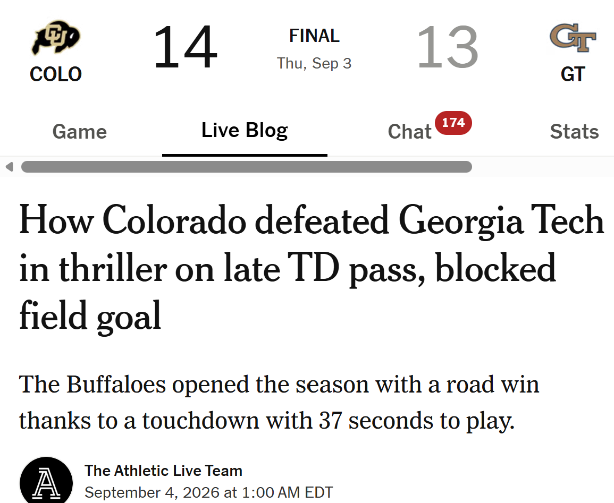
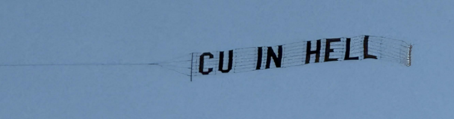

## Due dates

| What | When | Points |
|---|---|---|
| [Campus Scavenger Hunt](../assignments/deliverables/scavenger-hunt.qmd) &mdash; photos to Canvas | **Tonight**, Sept. 4, 11:59 PM ET | 40 (4%) &middot; Academic Planning |
| [Resume](../assignments/deliverables/resume.qmd) &mdash; PDF to Canvas, `Lastname-Firstname-Resume.pdf` | Sept. 11, 11:59 PM ET | 100 (10%) &middot; Career Readiness |
| GT Career Center resume reviews | Sept. 8 in person &middot; Sept. 9&ndash;10 virtual | &mdash; |
| **Fall 2026 All Majors Career Fair** | Sept. 14&ndash;15 | &mdash; |

::: {.highlight-box}
**The Scavenger Hunt is due tonight.** One person per group uploads all the photos.
:::

::: notes
Ask for a show of hands: whose group has already submitted? Anyone still without a group needs to
be sorted out before they leave today. Remind them the resume deadline sits three days before the
career fair by design.
:::

---

## Meanwhile, on Thursday night

:::: {.columns}
::: {.column width="44%"}
{fig-align="center" width="100%"}
:::
::: {.column width="56%"}
{fig-align="center" width="85%"}

{fig-align="center" width="85%"}
:::
::::

{fig-align="center" width="85%"}
