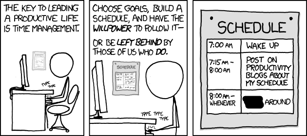
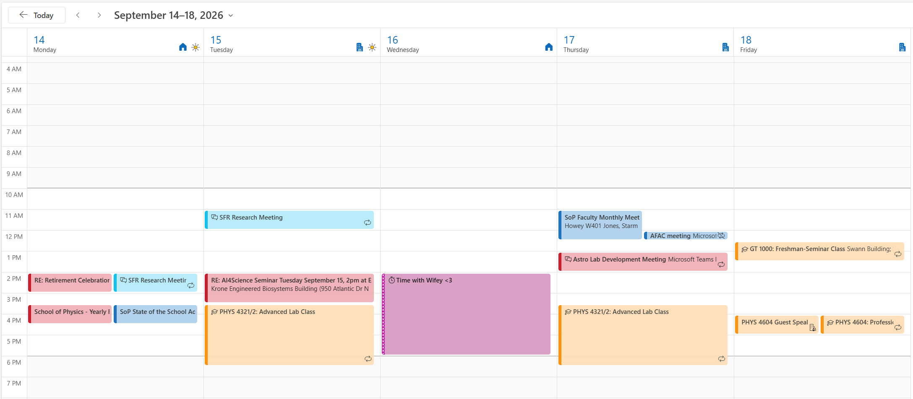

## Checkup

::: {.highlight-box}
**How are things going for you during your first few weeks at Georgia Tech?**
:::

A few things to get you started:

::: {.nonincremental}
- What has gone **better** than you expected?
- What has been **harder** than you expected?
- What advice do you have for others?
:::

::: notes
Let the silence run. If nobody volunteers, pair them up for two minutes and then report out.
:::

---

## Time management

{fig-align="center" width="100%"}

::: {.cite-note}
[xkcd #874 "Time Management"](https://xkcd.com/874/) &middot; [CC BY-NC 2.5](https://creativecommons.org/licenses/by-nc/2.5/) &middot; (edited)
:::

---

## Time management

**Full disclosure:** I didn't start this slide deck until last night.

I probably need to hear some of the stuff we're going to discuss as well.

::: {.highlight-box}
**Reminder:** Your [resume](../assignments/deliverables/resume.qmd) is due **tonight, Sept. 11, 11:59 PM ET**.
:::

::: {.highlight-box}
The Fall 2026 All Majors Career Fair **is Sept. 14&ndash;15**.
:::

---

## The real "Freshman 15"

High school scheduled your time for you. College does not.

::: {.nonincremental}
- Roughly **15 hours** of class per week &ndash; and about **30** of work outside it.
- Nobody takes attendance in most of your classes.
- Nobody checks whether you did the reading.
- Nobody is helping you manage your sleeping or eating.
- The consequences show up **weeks** after the decision that caused them.
:::

::: {.highlight-box}
**Discuss:** Where is your unstructured time actually going right now?
:::

---

## Common strategies

::: {.nonincremental}
- **Keep a regular sleep schedule.** Try to wake-up the same time, every day.
- **Write things down.** A TODO list beats memory.
- **Go to class every time.** Maintain structure and consistency.
- **Schedule study time** like an appointment or class.
- **Schedule free time and leisure** on purpose.
- **Do not overwork.** Burnout is real.
- **Start big things early.**
- **Ask for help** sooner than feels necessary.
:::

---

## Sleep is the top priority

If you get only one of these right, make it this one.

::: {.nonincremental}
- Keep a **regular** schedule [@phillips2017; @okano2019].
- All-nighters trade tomorrow's performance for tonight's panic. The trade is bad.
- Sleep is when what you studied actually gets filed [@diekelmann2010; @rasch2013].
:::

::: {.highlight-box}
**Discuss:** What time did you go to sleep last night? What time did you go to sleep the night before?
:::

::: notes
Push back on sleep deprivation as a flex.
:::

---

## Lists and calendars

Two different methods. Use both.

:::: {.columns}
::: {.column width="50%"}
### The list

*What* has to happen.

Everything goes in one place: assignments, emails, errands. If it's only in your head, it will
surface at 1 AM.
:::
::: {.column width="50%"}
### The calendar

*When* it will happen.

If a task has no time attached to it, it is a wish. Put the work on the calendar next to the class
that assigned it.
:::
::::

::: {.highlight-box}
What do you use? Paper, phone, online calendar, nothing? The tool does not matter; checking it daily does.
:::

---

## Lists and calendars &ndash; example

{fig-align="center" width="100%"}

---

## Study efficiently

One hour with a tutor beats three alone with a textbook you are not absorbing. All of this is
**free** and already paid for by your tuition.

| Resource | What it is |
|---|---|
| [1-to-1 Knack Tutoring](https://www.success.gatech.edu/tutoring/1-to-1-tutoring/) | Book a GT student who already aced your course |
| [Drop-In Tutoring](https://www.success.gatech.edu/tutoring/drop-in-tutoring/) | Walk into Clough, no appointment needed |
| [Peer-Led Undergraduate Study (PLUS)](https://www.success.gatech.edu/tutoring/plus/) | Weekly small-group sessions for historically hard courses |

Even more resources: [success.gatech.edu/tutoring](https://www.success.gatech.edu/tutoring/)

::: {.highlight-box}
**Go before you are behind.** Tutoring is not remediation.
:::

::: notes
Ask who has already used any of these. PLUS covers exactly the courses they are in right now, and
drop-in needs no appointment.
:::

---

## Protect your peace and joy

Free time you planned is restorative. Free time you stole from work is not.

::: {.nonincremental}
- Sounds a bit lame, but put **leisure on the calendar.** A club, exercise, dinner with friends, a night off.
- Guard one block a week that is genuinely yours.
- [Why Procrastinators Procrastinate](https://waitbutwhy.com/2013/10/why-procrastinators-procrastinate.html) might be informative reading.
- Use the [Center for Mental Health Care](https://mentalhealth.gatech.edu/) if you need it.
:::

---

## Try one thing this week

Pick **one** strategy from today. Not five.

::: {.nonincremental}
- Make it small enough so not to be intimidating.
- Attach it to something you already do every day.
:::

---

## References

::: {#refs}
:::
